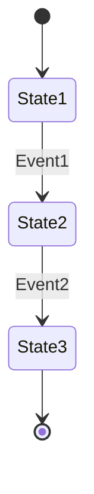

# State Machines: {Feature Name}

<!-- Lifecycle concepts: State machines with mermaid diagrams, transition tables, and invariants.
     Each state machine documents the complete lifecycle of an entity.
     These produce testable specifications:
     - Every valid transition = 1 happy path test
     - Every non-listed transition = 1 rejection test
     - Every invariant = 1 property-based test -->

## {StateMachineName}

### Transition Table

| From | Event | To | Guard | Effect |
|------|-------|----|-------|--------|
| | | | | |

### Invariants

<!-- Properties that must hold across ALL states. Each maps to a property-based test. -->

| ID | Invariant | Formal |
|----|-----------|--------|
| I1 | | `<!-- formal expression -->` |
